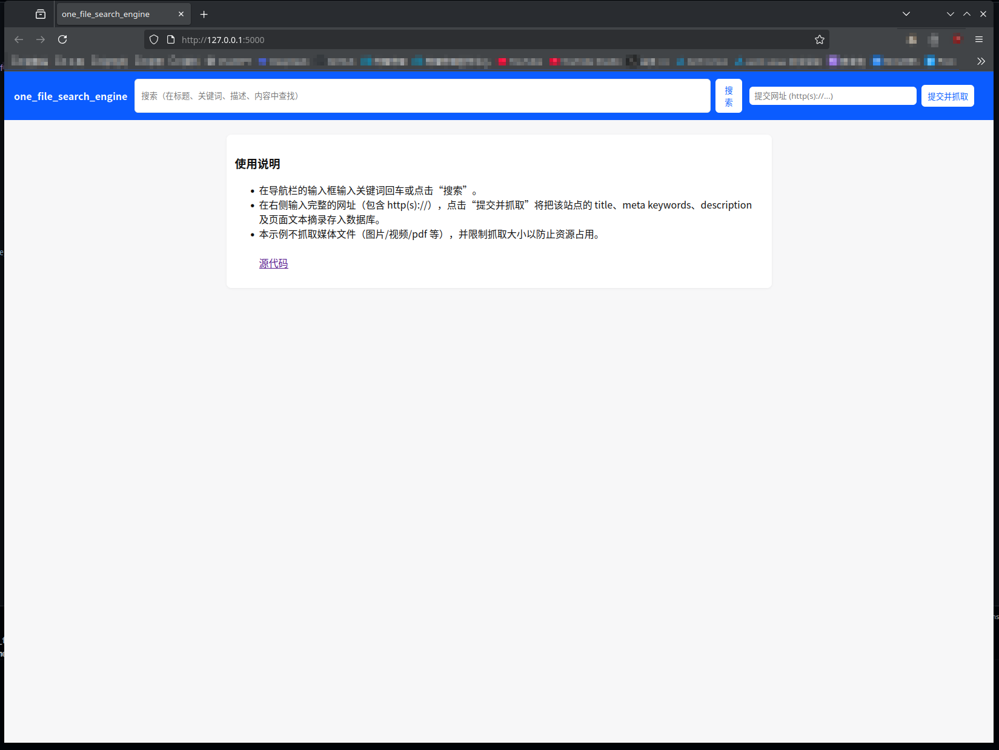

# One_File_Search_Engine
- v1.0效果图  

  


## 这是什么？
这是一个简易的轻量级的单文件搜索引擎（只需要准备Python，安装Flask。整个项目源码只有一个文件）  
使用Python编写，SQLite数据库，Flask Web服务，支持爬取网页，记录网页信息，并根据关键信息搜索的功能。

## 如何安装并使用？

### 手动部署
准备[Python3](https://www.python.org/downloads/release/python-3128/)环境  
克隆存储库并安装依赖：
```shell
git clone https://github.com/xhdndmm/one_file_search_engine && cd one_file_search_engine && pip install -r requirements.txt
```
- 注：旧版本可以在[这里](https://github.com/xhdndmm/one_file_search_engine/releases)下载  
启动程序：
```shell
python3 src/main.py
```
你可以使用tmux守护进程，或者gunicorn。

### Docker部署
安装好docker后和手动安装一样下载项目并
```shell
docker build -t one_file_search_engine .
docker run -d one_file_search_engine
```
或者
```shell
docker-compose up -d
```
即可

### 配置文件说明
```json
{
    "db_path": "sites.db",
    "max_fetch_bytes": 200 * 1024,
    "fetch_timeout": 8,
    "allowed_schemes": ["http", "https"],
    "user_agent": "Mozilla/5.0 (compatible; one_file_search_engine_bot/1.0; +https://github.com/xhdndmm/one_file_search_engine)",
    "robots_cache_ttl": 3600,
    "admin_user": "admin",
    "admin_password_hash": None,
    "secret_key": None,
    "disallow_private_networks": True
}
```
`db_path`
  - SQLite 数据库文件路径（默认 sites.db）。

`max_fetch_bytes`
  - 抓取单个页面时最多读取的字节数（示例为 200KB）。

`fetch_timeout`
  - 抓取 HTTP 请求的超时时间（秒）。

`allowed_schemes`
  - 允许抓取的 URL scheme 列表（通常是 http/https）。

`user_agent`
  - 抓取时使用的 User-Agent 字符串。

`robots_cache_ttl`
  - robots.txt 缓存有效期（秒），超过此时间会重新获取。

`admin_user`
  - 管理员用户名（默认为admin）。

`admin_password_hash`
  - 管理员密码的**哈希值**（不要放明文密码！生成方法在下面，默认随机生成）。
>[!IMPORTANT]
>
> 生成密码哈希值的方法：
> ``` python
>#运行下方代码
>from werkzeug.security import generate_password_hash
>print(generate_password_hash(input("输入要设置的管理员密码： ")))
>```
>在这里输入你要设置的密码，复制输出的结果到配置文件中

`secret_key`
  - Flask 会话/签名用的 secret key（应为随机且保密）。

`disallow_private_networks`
  - 是否拒绝抓取私有/回环地址（用于基本 SSRF 防护；true 推荐）。

**密码和密钥类文件请妥善保存！！！**

### 页面说明
`/`主页  
`/admin/login`登陆  
`/admin/dashboard`管理面板  
`/admin/logout`登出  

## 问题反馈及贡献
你可以在[这里](https://github.com/xhdndmm/one_file_search_engine/issues)反馈问题，欢迎你来提供宝贵的意见。  
同样你可以提交PR请求，为项目添砖加瓦。

## 其他
请遵守GPLV3开源协议